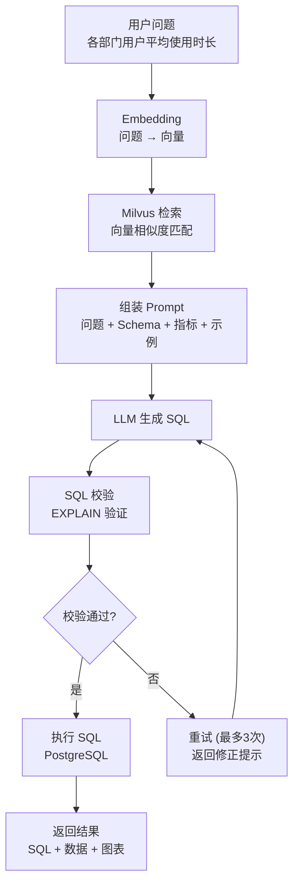

# Day 14 RAG 流程图

## NL2SQL RAG 完整流程

## 每一步大白话

1. **Embedding** — 把用户的问题变成一串数字（向量）
2. **Milvus 检索** — 在向量数据库里找最相关的 Schema 片段
3. **组装 Prompt** — 把问题、Schema、指标定义、SQL 示例拼成一个完整的指令
4. **LLM 生成 SQL** — 让 AI 根据指令写出 SQL
5. **SQL 校验** — 用 EXPLAIN 在数据库里验证 SQL 是否真的能执行
6. **执行** — 如果校验通过，真正执行 SQL，返回数据
7. **重试** — 如果校验失败，让 LLM 重写 SQL，最多试 3 次
