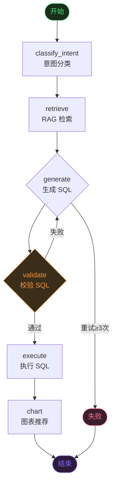

# Day 17 — NL2SQL LangGraph 状态图

## 节点说明

| 节点 | 作用 | 输入 | 输出 |
|------|------|------|------|
| classify_intent | 判断用户意图 | question | intent |
| retrieve | RAG 检索 | question | schema_context |
| generate | LLM 生成 SQL | question + schema | generated_sql |
| validate | EXPLAIN 校验 | generated_sql | sql_valid |
| execute | 执行 SQL | sql_valid=True | sql_result_data |
| chart | 图表推荐 | sql_result_data | chart_config |
